# RAPIDS Project Automation

## Overview

This collection of GitHub Actions workflows supports automation of the management of GitHub Projects, helping track development progress across RAPIDS repositories. 

The automations can also synchronize fields from PR to Issue such as the statuses, release information, and development stages into project fields, making project management effortless and consistent.

## 🔍 The Challenge

GitHub Projects are powerful, but automating them is not straightforward:

- Each item has a **project-specific ID** that's different from its global node ID
- Different field types (text, date, single-select, iteration) require different GraphQL mutations
- Linking PRs to issues and keeping them in sync requires complex operations
   - Work often begins in an Issue, but then is completed in a PR, requiring this synchronization

### PRs can be linked to multiple issues, and issues can be linked to multiple PRs which can lead to challenges in automation

The PR-to-Issue linkage exists within the PR's API, but not within the Issue's API. Additionally, in GitHub if many PRs are linked to an issue, closing _any_ of the PRs will close the issue.

The shared workflows here follow a similar pattern in that if `update-linked-issues` is run, it will update all issues linked to the PR if they are in the same project as the target workflow (ie issues with multiple Projects will only have the matching Project fields updated).

## 🧩 Workflow Architecture

By centralizing this logic in reusable workflows, all RAPIDS repositories maintain consistent project tracking without duplicating code.

Using a high-level tracker as an example, the automation is built as a set of reusable workflows that handle different aspects of project management (♻️ denotes a shared workflow):

```mermaid
flowchart LR
    A[PR Event] --> B[project-high-level-tracker ♻️]
    B --> D[get-stage-field]
    B --> E[get-project-id ♻️]
    D --> F[update-stage-field ♻️]
    E --> G
    E --> F
    E --> H[update-week-field ♻️]
    E --> I[set-opened-date-field ♻️]
    E --> J[set-closed-date-field ♻️]
    F --> K[update-linked-issues ♻️]
    G --> K
    H --> K
    I --> K
    J --> K
```



## 📁 Workflows

### Core Workflows

1. **project-get-item-id.yaml**  
   Gets the project-specific ID for an item (PR or issue) within a project - a critical first step for all operations.

2. **project-set-text-date-numeric-field.yaml**  
   Updates text, date, or numeric fields in the project.

3. **project-get-set-single-select-field.yaml**  
   Handles single-select (dropdown) fields like Status, Stage, etc.

4. **project-get-set-iteration-field.yaml**  
   Manages iteration fields for sprint/week tracking.

### Support Workflow

5. **project-update-linked-issues.yaml**  
   Synchronizes linked issues with the PR's field values.<br>
   Unfortunately, we cannot go from Issue -> PR; the linkage exists only within the PR's API.


## 📋 Configuration

### Project Field IDs

The workflows require GraphQL node IDs for the project and its fields. These are provided as inputs:

```yaml
inputs:
  PROJECT_ID:
    description: "Project ID"
    default: "PVT_placeholder"  # PVT = projectV2
  WEEK_FIELD_ID:
    description: "Week Field ID"
    default: "PVTIF_placeholder"
  # ... other field IDs
```

### Getting Project and Field IDs

To gather the required GraphQL node IDs for your project setup, use the included helper script:

```bash
python docs/get-project-field-info.py --token YOUR_GITHUB_TOKEN --org PROJECT_ORG_NAME --project PROJECT_NUMBER
```

Using the cuDF Python project, https://github.com/orgs/rapidsai/projects/128
```bash
python docs/get-project-field-info.py --token ghp_placeholder --org rapidsai --project 128
```

The script will output:
1. The Project ID (starts with `PVT_`) - use this for the `PROJECT_ID` input
2. A dictionary of all fields in the project with their IDs and metadata:
   - Regular fields (text, date, etc.) `PVTF_...`
   - Single-select fields include their options with option IDs `PVTSSF_...`
   - Iteration fields include configuration details `PVTIF_...`

Example output:
```bash
PVT_kwDOAp2shc4AiNzl

'Release': {'id': 'PVTSSF_lADOAp2shc4AiNzlzgg52UQ',
             'name': 'Release',
             'options': {'24.12': '582d2086',
                         '25.02': 'ee3d53a3',
                         '25.04': '0e757f49',
                         'Backlog': 'be6006c4'}},
 'Status': {'id': 'PVTSSF_lADOAp2shc4AiNzlzgaxNac',
            'name': 'Status',
            'options': {'Blocked': 'b0c2860f',
                        'Done': '98236657',
                        'In Progress': '47fc9ee4',
                        'Todo': '1ba1e8b7'}},
                        ...
```

Use these IDs to populate the workflow input variables in your caller workflow.

## 📊 Sample Use Case

### Tracking PR Progress

The workflow automatically tracks where a PR is in the development lifecycle:

1. When a PR is opened against a release branch, it's tagged with the release
2. The stage is updated based on the current date relative to release milestones
3. Week iteration fields are updated to show current sprint
4. All linked issues inherit these values


## 📚 Related Resources

- [GitHub GraphQL API Documentation](https://docs.github.com/en/graphql)
- [GitHub Projects API](https://docs.github.com/en/issues/planning-and-tracking-with-projects/automating-your-project/using-the-api-to-manage-projects)

---

> [!Note]
> These workflows are designed for the RAPIDS ecosystem but can be adapted for any organization using GitHub Projects for development tracking.
